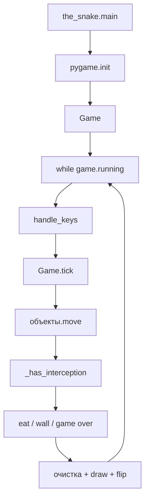

# Довести змейку до рабочего запуска

Тесты и экспорт «учебного» API из `[the_snake.py](the_snake.py)` не входят в работу. Цель — `python the_snake.py` открывает окно, змейка управляется стрелками, ест яблоки, врезается в себя/стены и корректно завершается.

## Как должно работать

- Края поля: **перенос на противоположную сторону** (`x % SCREEN_WIDTH`, `y % SCREEN_HEIGHT`). Столкновение со стеной и с собой — game over.
- Кадровая синхронизация: **один** `clock.tick` внутри `Game.tick`.
- Один `Renderer` живёт в `Game`, создаётся **после** `pygame.init()`.

## 1. Точка входа — `[the_snake.py](the_snake.py)`

Сейчас создаются два `Renderer` (ещё один внутри `Game()`), `tick()` зовётся из конструктора, `renderer.update` не вызывается, клавиши не читаются, при `False` цикл делает `continue` вместо выхода.

Свести `main()` к:

1. `pygame.init()`
2. `game = Game()`
3. `game.run()`
4. `while game.running:` — `handle_keys(game.snake)` (или эквивалент), затем `if not game.tick(): break`
5. `pygame.quit()`

Убрать локальный `Renderer`. Не создавать `Game` на уровне модуля.

Для клавиш экспортировать змейку с `Game` (свойство `snake`) либо вызывать `handle_keys` из `Game.tick` до `move()`. Второй вариант проще и не дублирует доступ к частным полям.

## 2. Игровой цикл — `[core/game.py](core/game.py)`

Исправить инициализацию и шаг кадра:

- Не вызывать `self.tick()` в `__init__`.
- Сразу добавить змейку **и первое яблоко** в `_game_objects`.
- В `tick()`: обработка клавиш (если не в `main`) → `move()` всех объектов → проверка столкновений → удаление/спавн → **очистить экран** → нарисовать все объекты → `renderer.update()`.
- Не создавать `Wall(None)`: `Wall(...)` всегда truthy. Стену добавлять только если `eat()` вернул список клеток.
- После съедения яблока класть его в `_game_objects_to_remove` и **сразу создать новое** на свободной клетке.
- `_has_interception()`: для змеи сравнивать голову с `positions[1:]`; для остальных — `snake.head in object.positions` (стена занимает несколько клеток). Не использовать имя `object`.
- `_game_over()`: `self.stop()`, опционально залить поле фоном. Выход из цикла сделает `main`.

## 3. Движение змейки — `[objects/snake.py](objects/snake.py)`

`move()` сейчас только удаляет хвост — тело не следует за головой.

Каждый ход:

- новая голова = текущая + `direction * GRID_SIZE`, затем wrap по экрану;
- `insert(0, new_head)`;
- если в этом ходе не было роста — `pop()` хвоста.

Рост: при обычном/спец. яблоке (кроме гнилого) не удалять хвост на этом ходе (флаг `grow` / параметр), **не** делать `inc(apple.head)` — это дублирует голову, которая уже на клетке яблока.

Дополнительно:

- Свойство `direction` → `_direction`. В `update_direction` запретить разворот на 180° (сейчас в `[handle_keys](core/mechanics.py)` UP/DOWN проверяют «не то же направление», а не противоположное).
- `reverse_snake()`: вызвать `self._positions.reverse()` и развернуть вектор направления, чтобы хвост стал головой.
- `throw_half()`: если длина `< 2`, не порождать стену (вернуть `None` / пустой список и не резать змею в ноль).
- `eat()` по типам яблока (см. ниже), вызывать `detect_type` гарантированно до чтения `aid`/`rotten`/…

## 4. Яблоки и стены

`[objects/apple.py](objects/apple.py)`:

- В `__init__` вызвать `detect_type()` и задать цвет (можно пока один `APPLE_COLOR`).
- Реализовать `move()` (пусто или уменьшение `life_time` — на геймплей не обязательно).
- Спавн только на свободной клетке: передать занятые позиции (змея, стены, другие яблоки) в рандом. В `[GameObject._randomize_position](objects/game.py)` заменить `randint(0, GRID_WIDTH)` на `randrange(GRID_WIDTH)` / `GRID_HEIGHT`, иначе возможны координаты на границе экрана.

`[objects/wall.py](objects/wall.py)`:

- Не `return None` из `__init__` (экземпляр всё равно создаётся). Если позиций нет — не конструировать стену снаружи.
- В `move()` уменьшать `life_time`; при `<= 0` помечать объект к удалению (флаг/`life_time`, который `Game.tick` подхватит) — иначе стены копятся навсегда.

Эффекты яблок (как в комментариях к `AppleType`):

| Тип    | Поведение                                                                                                               |
| ------ | ----------------------------------------------------------------------------------------------------------------------- |
| normal | рост на 1                                                                                                               |
| rotten | отрезать половину → стена; длина 1 — без стены и без game over                                                          |
| drunk  | инвертировать направление                                                                                               |
| hot    | `reverse_snake()` + `speed.inc()`                                                                                       |
| aid    | сбросить скорость (`speed.set_default()`); если последний эффект был drunk — ещё раз инвертировать направление (отмена) |

Для `hot`/`aid` скорости `Game.tick` должен уметь вызвать методы `Speed` (например, `eat` возвращает тип/эффект, а `Game` применяет скорость).

## 5. Ввод и отрисовка

`[core/mechanics.py](core/mechanics.py)` — `handle_keys`:

- UP: нельзя, если направление `DOWN`; DOWN: нельзя, если `UP`; LEFT/RIGHT уже почти верные.
- Выход по крестику окна оставить (`QUIT` → stop + `SystemExit` или `game.stop()` без исключения — лучше `game.stop()`, чтобы дойти до `pygame.quit()`).

`[core/renderer.py](core/renderer.py)`:

- Метод `clear()` / заливка `BOARD_BACKGROUND_COLOR` в начале кадра, иначе следы тела.
- После всех `draw` — один `pygame.display.update()`.

## 6. Что не делать

- Не подгонять экспорты под `[tests/](tests/)`.
- Не раздувать README дальше короткой команды запуска, если не попросите.
- Не оставлять второй `clock.tick` в `main`.

