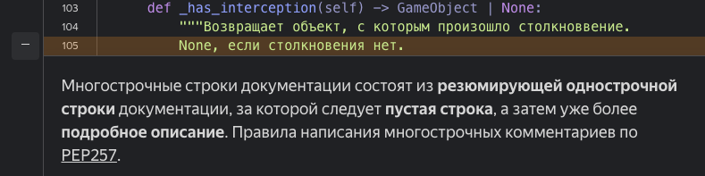
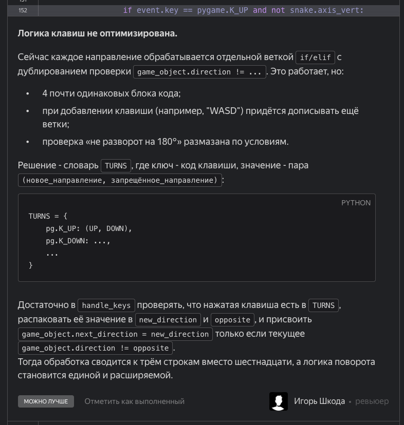
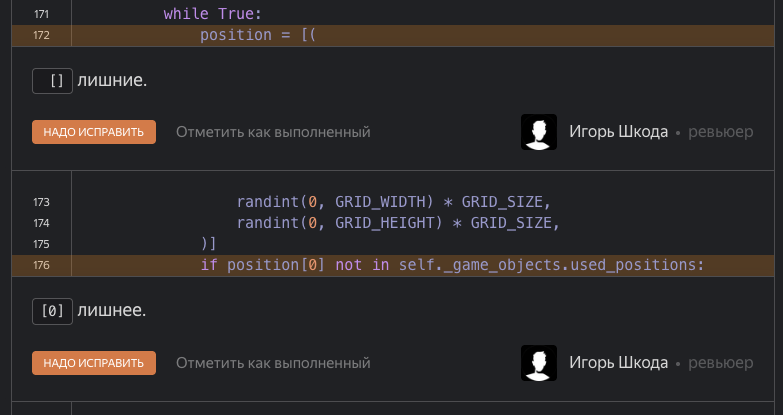
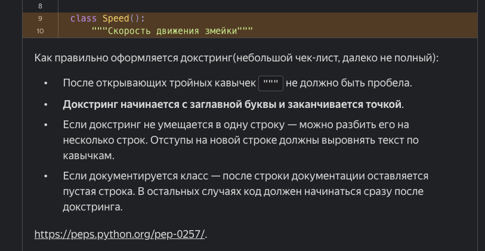
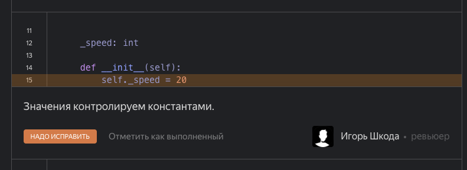
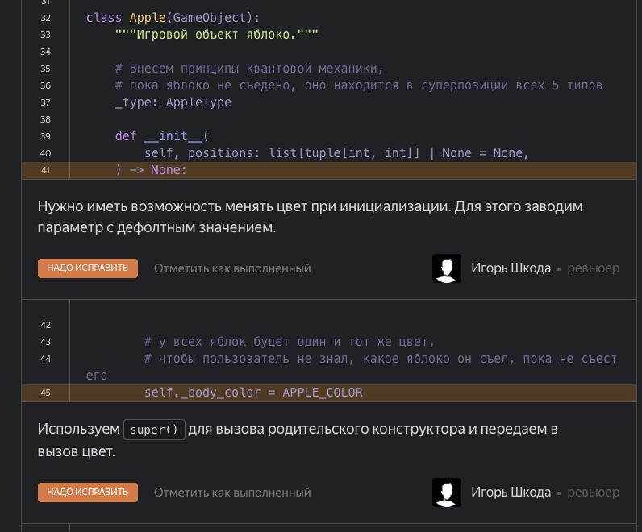
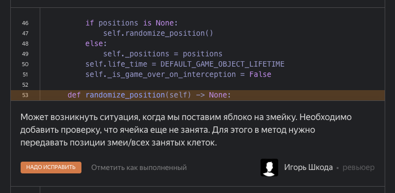
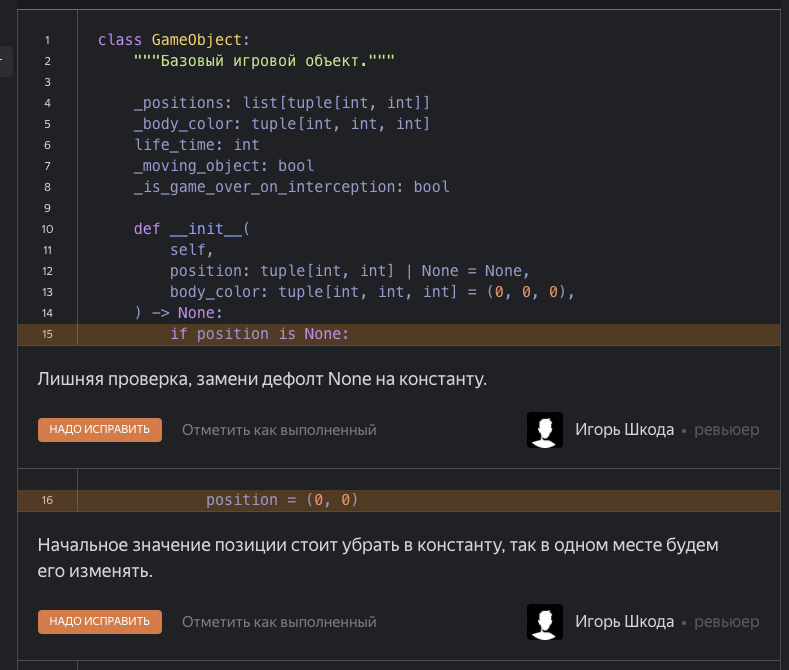
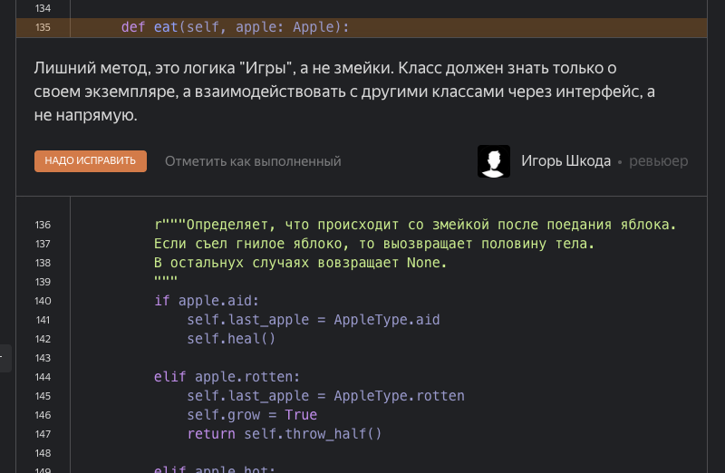
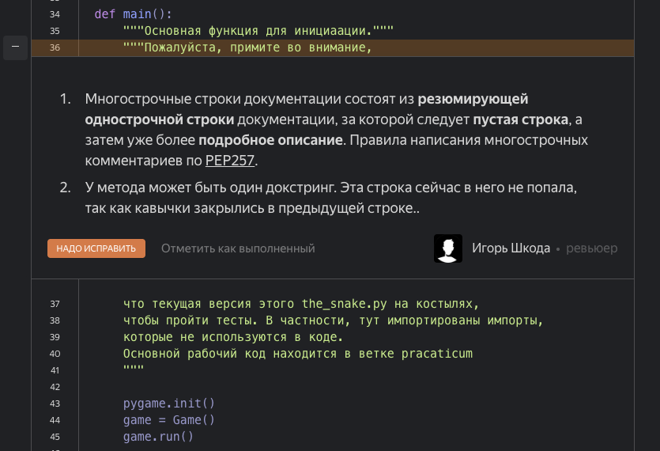

#### За эти замечания спасибо
- проверить, что все значения задаются константами [да, согласен]
- убрать все скобки в классах, где нет наследования [ок, исправил. спасибо]
- esc к игре [да, согласен, добавил]

#### Замечания к замечаниям

- завести константы цветов. [ок, сделал. Но непонятно зачем и почему тут стоит пометка "Можно лучше". Чем это лушче? Заданы константы, которые нигде в коде не используются]

- двухстрочный докстринг к методу
Это нельзя сделать не сократив строчку, тк в конфиге флейка стоит ограничение на длину строки в 79 символов.
Если увеличить это ограничение локально, то код не пройдет тест после загрузки на ревью. 
Если сократить описание, то половина функционала в докстринге не читается и нужно лезть внутрь за новым комментарием, чтобы понять логику
Более того, в других комментариях есть обратное замечание. 
И ещен почему-то в других методах нет аналогичного замечания
- 

- логика клавиш не оптимизирована.
Вариант, который предлагает ревьюер, не будет работать в этой змейке тк нужна проверка вертикального/горизонтального движения. В игре есть яблоко, поедание которого реверсит клавиши управления. Без проверки змейка будет врезаться себе в шею

- лишние [] и [0]. [исправил и перенест создание списка в return. Но логи]
Не лишние, тк позиции в в этой игре всегда передаются в листе, даже если это одна позиция. init классов на это опираются

- оформление докстрингов [ок, исправил]
К этому моменту начинает складываться впечатление, что мы учимся документировать код. Но если есть замечание по точке в докстринге, почему других замечаний по докстрингам нет? 
И вот тут, кстати,  как раз идет ссылка о двустрочных комментариях, по которым были сделаны замечания ранее

- Значение скорости задать константами [да, согласен, исправил]
В этом же файле чуть выше импортирована константа скорости, а чуть ниже она используется. Но судя по комменту, ревьюер этого не увидел

- Задать цвет яблока при инициализации.
Мы не будем задавать цвет при инициализации, тк все экземпляры яблока на поле должны быть одного цвета. Опять-таки это одно из уловий этой игры, которое понятно из многочисленных комментариев в коде. Если надо поменть цвет яблока в игре -- есть неиспользуемые константы

- исключение занятых клеток при рандомизации координат нового объекта [удалил метод и ссылку на него при инициализации]
Логичное замечание. Но внимательный ревьюер увидит эту проверку в другом классе (классе игры), а также, что рассматриваемый метод не используется в коде, кроме инициализации объекта при условии передачи в класс свободных координат. А все инициализации в игре происходят с заданием этих координат. 
И еще очень странно получить рекомендацию ревьюера о передаче занятых клетках в класс (в обход принципам ООП), когда через несколько комментариев он сам же и пишет, что класс должен знать только о себе и все взаимодействие идет через интерфейс. 

- заменить проверку на дефолтное значение [согласен, не убрал этот артефакт с ранней версии]

- лишний метод eat в классе snake
вот он как раз не лишний, потому что определяет поведение змейки после съеденного яблока. 
Да, в класс передается экземпляр яблока, но мы из него берем только значение типа яблока

- докстринги. [перенес этот текст в начало файла. Если кто-то это будет читать]
Да, но при пустой строке линтер говорит, что нельзя после докстринга делать пустую строку.
А сам комментарий к докстрингу не относится, поэтому вносит его внутрь нельзя
